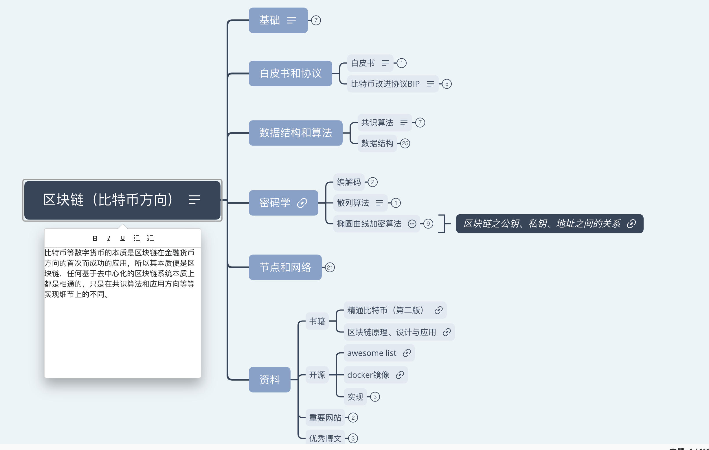
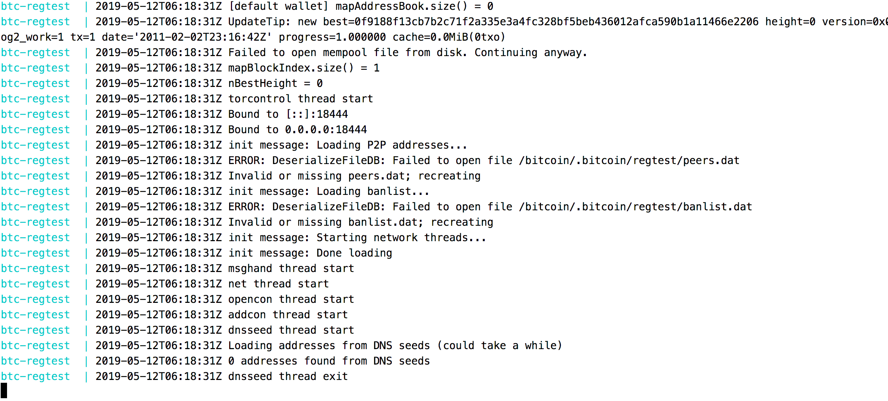
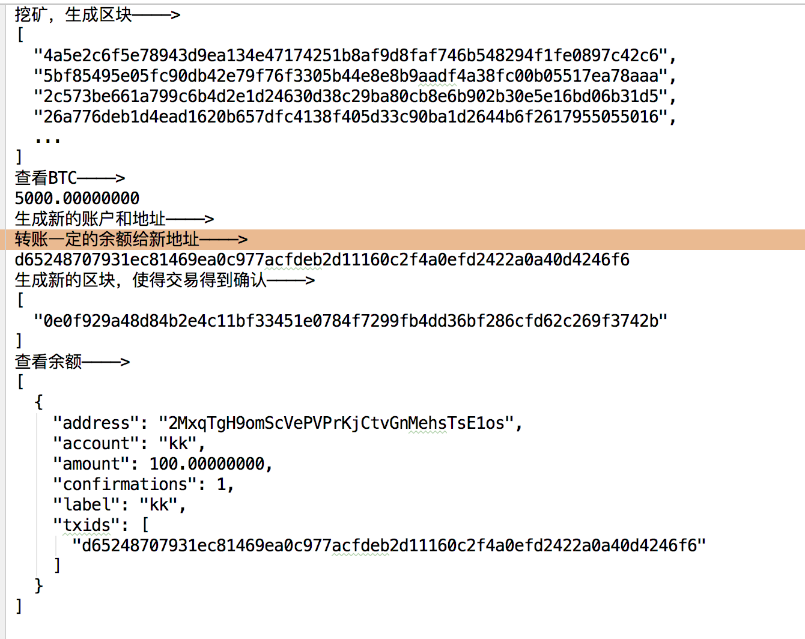

# bitcoin-booter
比特币学习和脚本整理

>### 目录

- [TODO-LIST](#todo)
- [思维导图](#xmind)
- [docker和脚本](#docker-script)
	- [docker](#docker)
	- [脚本](#script)
- [启动和测试回归节点](#start-reg)
	- [启动回归节点](#start-node)
	- [测试常用命令](#test-cmds)

>### <a name="todo">TODO-LIST</a>

- 思维导图 【✔】
- docker部署 【✔】
- 自动化测试脚本 【✔】
- java demo
- android demo
- ios demo
- ...

>### <a name="xmind">思维导图</a>

力求以通俗、简练的Note解释区块链（数字货币）牵涉的复杂、抽象概念，并尽可能附上高质量文章的超链接和直观的图表，从而帮助快速形成全方位的区块链感官认知。

从上至下、层层深入，揭示区块链是如何在现有技术上一步步创造出来的，这些精妙的思想和关于“信用即货币”的哲学才是其最大的魅力所在。

推荐有一定后端编程经验（尤其是分布式业务系统）参考助学！



>### <a name="docker-script">docker启动和脚本</a>

#### <a name="docker">docker</a>

使用下载量最高的bitcoind镜像**`kylemanna/bitcoind`**，并用docker-compose容器编排工具配置管理

配置文件 **`docker/regtest/bitcoin-compose.yml`**

```
version: '3'

services:
  omnicored:
    container_name: btc-regtest
    image: kylemanna/bitcoind
    volumes:
      - ./bitcoin.conf:/bitcoin/.bitcoin/bitcoin.conf
    ports:
      - 8333:8333
      - 18332:18332
```

#### <a name="script">脚本</a>

- 脚本1：**`docker/regtest/docker-cli.sh`** 用于容器btc容器的启动和管理，支持的**`action`**有
	- **up** 启动本地回归模式的btc节点容器
	- **down**  停止容器，但不清理，可重启
	- **clean** 停止并清理容器，所有旧的数据将丢失
	- **in** 登录进入容器，执行容器内部的命令
	- **log** 查看容器日志

- 脚本2：**`docker/regtest/test-regtest.sh`** 在回归几点上测试**`打包区块 -> 获取比特币 -> 创建秘钥和地址（账号） -> 转账 -> 查看余额`** 等一系列比特币典型操作

>### <a name="start-reg">启动和测试回归节点</a>

#### <a name="start-node">启动回归节点</a>

执行命令

```
cd docker/regtest
./docker-cli.sh up
```

截图 --



#### <a name="test-cmds">测试常用命令</a>

```
cd docker/regtest
./test-regtest.sh
```

截图 -- 

